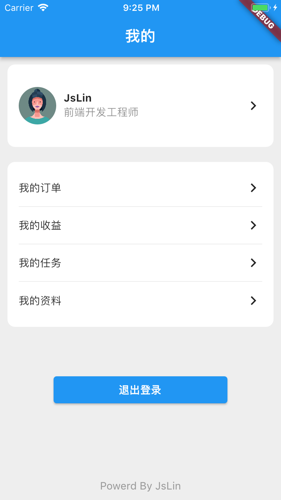

# flutter 学习&实战
  学习flutter布局，其实对于一个前端开发者来说，flutter布局很别扭，写起来很繁琐，很麻烦。
  但是呢，学习这个东西，不要因为自己不喜欢，而去抵触，当你明白其布局原来，布局组件如何使用时，其实写起来也很简单！
  下面记录了一些flutter的学习心得，花些时间看看学学写写，你也会了,其实知识这个东西，你去学它，他就会变得简单，加油💪🏻

# 官方教程
* [Flutter 布局基础教程](https://flutter.cn/docs/codelabs/layout-basics)
* [Flutter 中的布局](https://flutter.cn/docs/development/ui/layout)
* [为你的 Flutter 应用加入交互体验](https://flutter.cn/docs/development/ui/interactive)
* [Flutter 中文社区教程](https://flutter.cn/community/tutorials)
* [dart 中文文档](https://dart.cn/guides)  

# 环境搭建
 我这里用的是mac进行开发的，所以这里记录了下mac下的flutter 环境搭建
* [mac环境搭建](./lib//issue/macEnvBuild.md)

# Widgets 介绍
Widgets   [ˈwɪdʒɪts]  小部件(组件)
Flutter 从 React 中吸取灵感，通过现代化框架创建出精美的组件。它的核心思想是用 widget 来构建你的 UI 界面。 Widget 描述了在当前的配置和状态下视图所应该呈现的样子。当 widget 的状态改变时，它会重新构建其描述（展示的 UI），框架则会对比前后变化的不同，以确定底层渲染树从一个状态转换到下一个状态所需的最小更改

# 布局学习
* [Text用法](./lib/layout/text/readme.md)
* [Row布局](./lib/layout/row/readme.md)
* [Column布局](./lib/layout/column/readme.md)
* [Container布局](./lib/layout/container/readme.md)
* [Wrap 布局](./lib/layout/wrap/readme.md)
* [Stack, Positioned 布局](./lib/layout/stack/readme.md)
* [Align 布局](./lib/layout/align/readme.md)

# 遇到的问题&解决方案
* [布局中遇到的问题](./lib/issue/readme.md)
* [如何设置底部边框](./lib/issue/readme.md)
* [如何设置图片圆角](./lib/issue/readme.md)

# 实战
* 登录布局 ✅
* 我的页面 ✅ 
* 学习dart

# 效果演示

# TODO List
* 活动tag
* 输入框学习
* 增加登录交互
* 写一个我的页面
* dart 语言学习
* 学习使用组件
* 写一个计算器示例 
* 用 GridView 重构计算器
* 写一个简单商城首页
