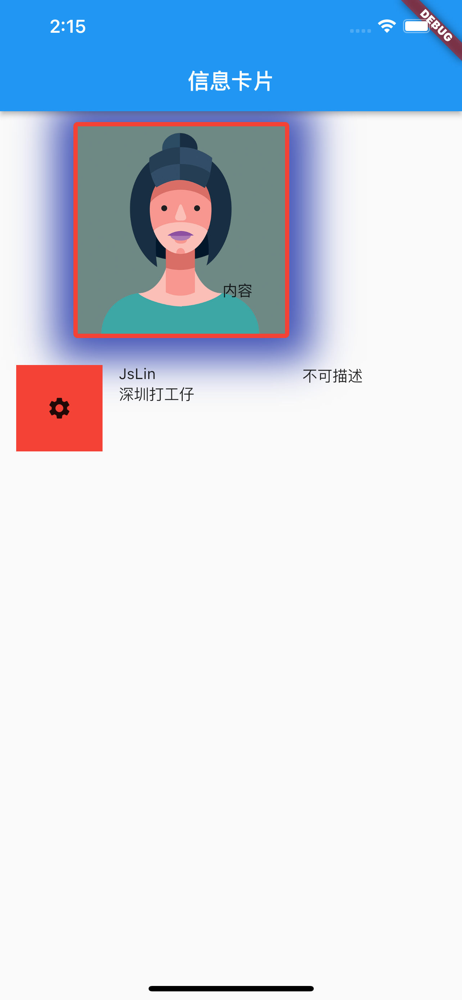

# Container 属性介绍
 
## 构造函数
```
  Container({
    Key? key,
    this.alignment,
    this.padding,
    this.color,
    this.decoration,
    this.foregroundDecoration,
    double? width,
    double? height,
    BoxConstraints? constraints,
    this.margin,
    this.transform,
    this.transformAlignment,
    this.child,
    this.clipBehavior = Clip.none,
  }) 
```
## 属性介绍
* alignment： 控制child的对齐方式
* padding：   内边距
* margin ： 外边距
* color： 盒子背景色（`如果decoration 装饰属性设置了背景，外层不要再重复设置背景，不然会报错`）
* width：宽度 如:100.0
* height：高度 如：100.0
* decoration 装饰属性，包含（背景，边框，圆角，背景图，阴影等）
* foregroundDecoration： 绘制在child前面的装饰
 * constraints：添加到child上额外的约束条件，如限制最大最小宽高
 * transform：设置container的变换矩阵，偏移
 * child ： container中的内容widget

## 代码示例
```
 Container(
              //约束盒子最大最小宽高
              constraints: new BoxConstraints(
                  minHeight: 100, maxHeight: 200, minWidth: 100, maxWidth: 200),
              margin: EdgeInsets.all(10.0),
              padding: EdgeInsets.all(30.0),
              alignment: Alignment.bottomRight,
              decoration: new BoxDecoration(
                color: Colors.green,
                //设置四周圆角 角度
                borderRadius: BorderRadius.all(Radius.circular(4.0)),
                //设置四周边框
                border: new Border.all(width: 4, color: Colors.red),
                boxShadow: [
                  BoxShadow(
                      offset: Offset(2, 1), //x,y轴
                      color: Colors.indigo, //投影颜色
                      blurRadius: 30, //模糊半径
                      blurStyle: BlurStyle.normal, //模糊风格
                      spreadRadius: 20 //扩展半径

                      )
                ],
                image: new DecorationImage(
                  image: new NetworkImage(
                      'https://semantic-ui.com/images/avatar2/large/kristy.png'),
                ),
              ),
              transform: new Matrix4.rotationY(0),
              child: Text('内容'),
            ),
```
 
# 学习 效果演示
