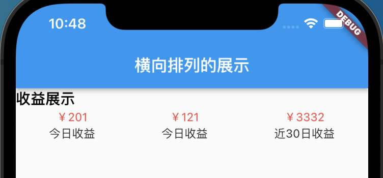

# Row 布局
Row 会让 widgets 水平排列 ,类似Web中Flex布局
[官方教程](https://flutter.cn/docs/codelabs/layout-basics#row-and-column-classes)
# 构造函数
```
  Row({
    Key? key,
    MainAxisAlignment mainAxisAlignment = MainAxisAlignment.start,
    MainAxisSize mainAxisSize = MainAxisSize.max,
    CrossAxisAlignment crossAxisAlignment = CrossAxisAlignment.center,
    TextDirection? textDirection,
    VerticalDirection verticalDirection = VerticalDirection.down,
    TextBaseline? textBaseline, // NO DEFAULT: we don't know what the text's baseline should be
    List<Widget> children = const <Widget>[],
  })
```
# 属性介绍
* MainAxisAlignment 主轴排列方向，默认开始
> start,end,center,spaceBetween,spaceAround,spaceEvenly
* MainAxisSize
* CrossAxisAlignment 竖直对齐方式
> start,end,center,stretch,baseline
 * VerticalDirection 定义了children摆放顺序，默认是down
> down：从top到bottom进行布局
> up：从bottom到top进行布局
* TextBaseline

# 示例代码
```
import 'package:flutter/material.dart';

// 默认用法
class RowBase extends StatelessWidget {
  @override
  Widget build(BuildContext context) {
    return new Scaffold(
        appBar: new AppBar(
          title: new Text('RowBase'),
        ),
        body: ListView(
          children: [
            new Row(
              children: <Widget>[
                const Text('你好'),
                const Text('你好'),
                const Text('你好'),
              ],
            ),
            // 主轴开始排列
            new Row(
              mainAxisAlignment: MainAxisAlignment.start,
              children: <Widget>[
                const Text('你好'),
                const Text('你好'),
                const Text('你好'),
              ],
            ),
            // row 居中排列
            new Row(
              mainAxisAlignment: MainAxisAlignment.center,
              children: <Widget>[
                const Text('你好'),
                const Text('你好'),
                const Text('你好'),
              ],
            ),
            //  row 结束位置排列
            new Row(
              mainAxisAlignment: MainAxisAlignment.end,
              children: <Widget>[
                const Text('你好'),
                const Text('你好'),
                const Text('你好'),
              ],
            ),
            // row 两边对齐
            new Row(
              mainAxisAlignment: MainAxisAlignment.spaceBetween,
              children: <Widget>[
                const Text('你好'),
                const Text('你好'),
                const Text('你好'),
              ],
            ),
            // row 环绕对齐
            new Row(
              mainAxisAlignment: MainAxisAlignment.spaceAround,
              children: <Widget>[
                const Text('你好'),
                const Text('你好'),
                const Text('你好'),
              ],
            ),
            // row 等分对齐
            new Row(
              mainAxisAlignment: MainAxisAlignment.spaceEvenly,
              children: <Widget>[
                const Text('你好'),
                const Text('你好'),
                const Text('你好'),
              ],
            ),
          ],
        ));
  }
}
```

# demo1 实战 效果展示
* [代码](./demo1.dart)




