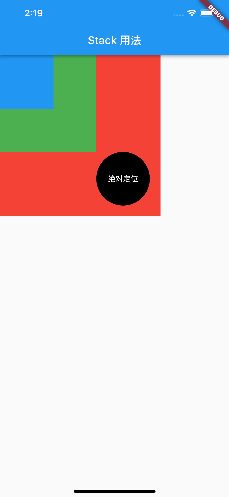

# Stack
Stack ： 堆栈，层叠布局
取代线性布局  ，Stack允许子 widget 堆叠,可以使用 Positioned 来定位他们相对于Stack的上下左右四条边的位置。Stacks是基于Web开发中的绝度定位（absolute positioning )布局模型设计的
# 构造函数
```
 Stack({
    Key? key,
    this.alignment = AlignmentDirectional.topStart,
    this.textDirection,
    this.fit = StackFit.loose,
    this.overflow = Overflow.clip,
    this.clipBehavior = Clip.hardEdge,
    List<Widget> children = const <Widget>[],
  }) 
```

## 属性介绍
* alignment ： 设置子Widget开始展示的位置，默认从顶部开始展示
> AlignmentDirectional.topCenter//从顶部中间开始展示
    AlignmentDirectional.topEnd//从顶部结束位置展示
    AlignmentDirectional.centerStart//从中间开始位置开始展示
    AlignmentDirectional.center//从正中间展示
    AlignmentDirectional.centerEnd//从中间结束位置展示
    AlignmentDirectional.bottomStart//从底部开始位置展示
    AlignmentDirectional.bottomCenter//从底部中间位置展示
    AlignmentDirectional.bottomEnd//从底部结束位置展示
 
* textDirection： 设置子widget的左右显示方位
* fit ：设置没有通过positioned包裹的子widget的size
> StackFit.loose：以他子widget最大的size展示
StackFit.expand：stack的size等于他父widget的size
* overflow： Overflow.clip,子widget超出stack时的截取方式，参考Text的溢出截取方式
* children：一组子widgets


# Positioned
也是一个部件(widget)和Stack 配合使用，控制子组件的位置
## 构造函数
Positioned({
    Key? key,
    this.left,
    this.top,
    this.right,
    this.bottom,
    this.width,
    this.height,
    required Widget child,
  })
## 属性介绍
* left： 距离左边位置
* top： 距离顶部位置
* right：距离右边位置
* bottom： 距离底部距离
* width： 部件宽度
* height： 部件高度
* child：子部件


# 代码示例
```
import 'package:flutter/material.dart';

class StackEmp extends StatelessWidget {
  @override
  Widget build(BuildContext context) {
    return new Scaffold(
        appBar: new AppBar(
          title: Text('Stack 用法'),
        ),
        body: Stack(
          children: <Widget>[
            Container(
              width: 300,
              height: 300,
              color: Colors.red,
            ),
            Container(
              width: 180,
              height: 180,
              color: Colors.green,
            ),
            Container(
              width: 100,
              height: 100,
              color: Colors.blue,
            ),
            Positioned(
              bottom: 20,
              right: 20,
              child: Container(
                width: 100,
                height: 100,
                alignment: Alignment.center,
                decoration: new BoxDecoration(
                    color: Colors.black,
                    borderRadius: BorderRadius.all(Radius.circular(50))),
                child: Text('绝对定位',
                    style: TextStyle(
                      color: Colors.white,
                    )),
              ),
            ),
          ],
        ));
  }
}

```

# 学习效果演示



